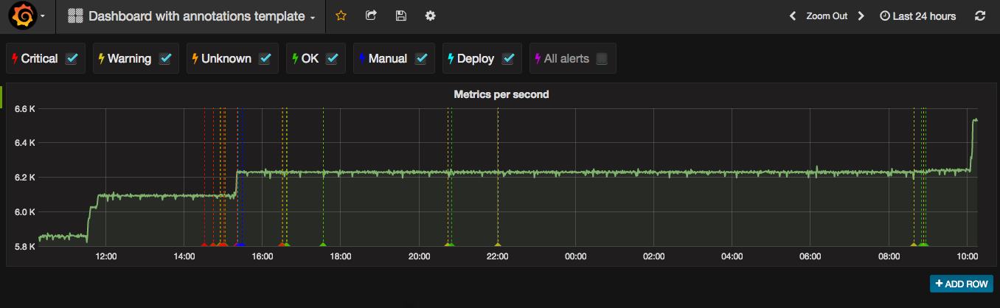
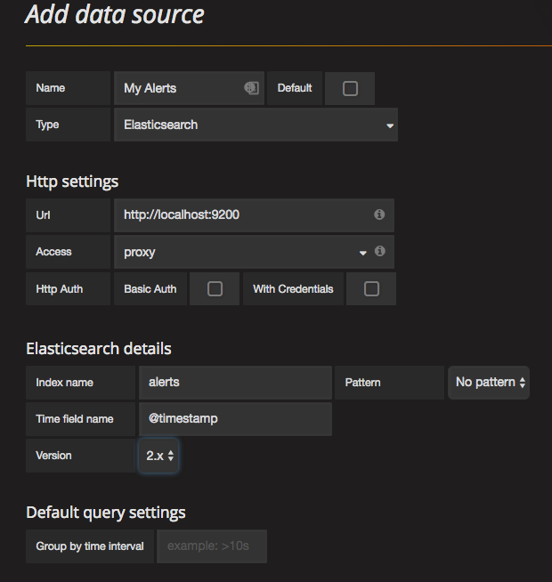
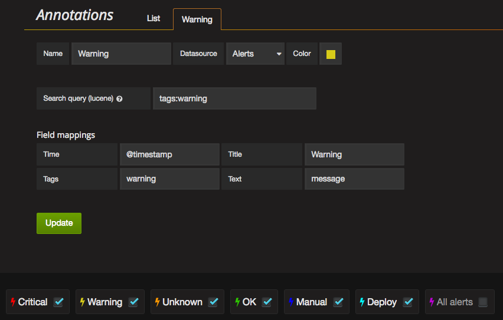

# Elasticsearch Tools & Utilities

Here is some utilites I have written to interact with elasticsearch

## es_post.sh

This is a bash script that uses curl or wget to post to elasticsearch. You configure inside script

    es_server=localhost
    es_port=9200
    es_type=automation
    es_index=info

### post to elasticsearch.py

This little utility will add a small item to your desired index.

Usage:

    post_to_elasticsearch.py --index=alerts --tag=alerts,warning --host=localhost --port=9200 --message="System load is slightly high"

index, tag and message is mandatory arguments. host will default to localhost and port will default to 9200.

You need to add a Elasticsearch datasource to your 3.x+ Grafana

Then to add annotation you have to add a search in your elasticsearch index for each type of annotation you want to add.

As you can see on my screenshot I have different colors for Critical, Warning, Unknown and OK. They are sent from my monitoringsystem. Deploy and Manual is sent by CI-system and various manual one-off scripts.

I have selected to add the tag alerts to all things I write, so I can show all alerts in the same color also if I choose to.